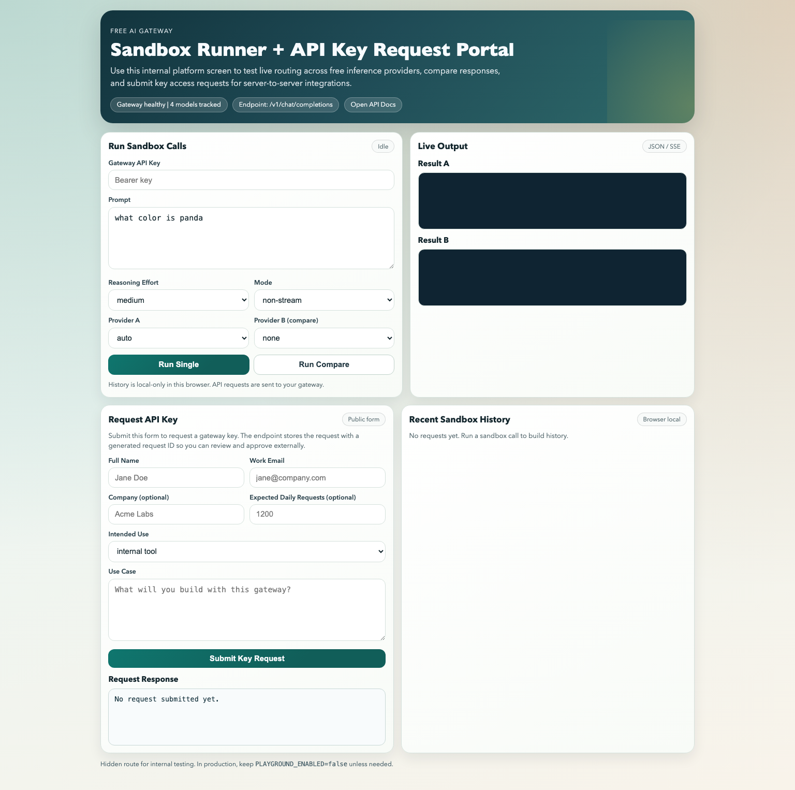
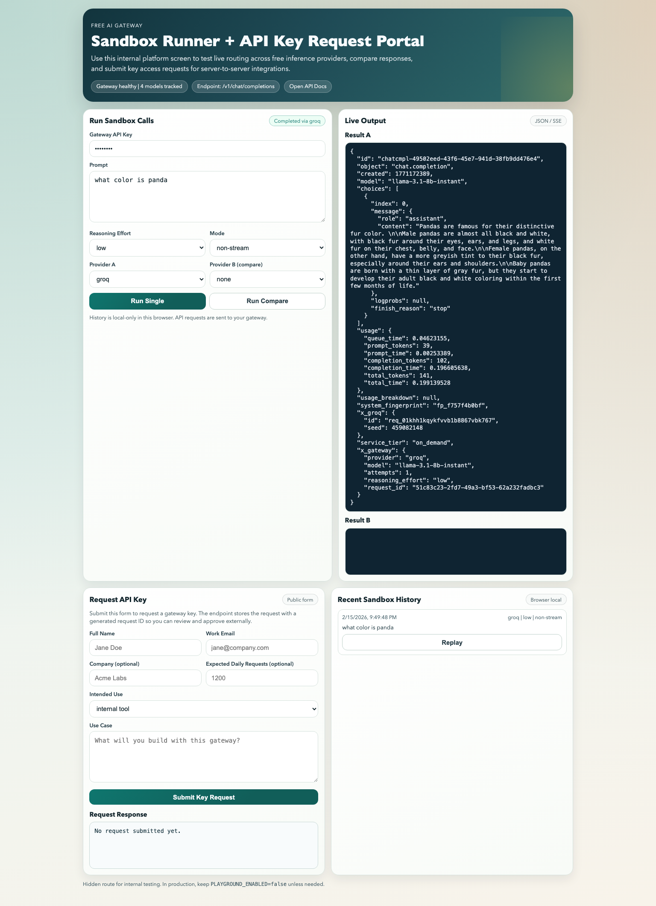
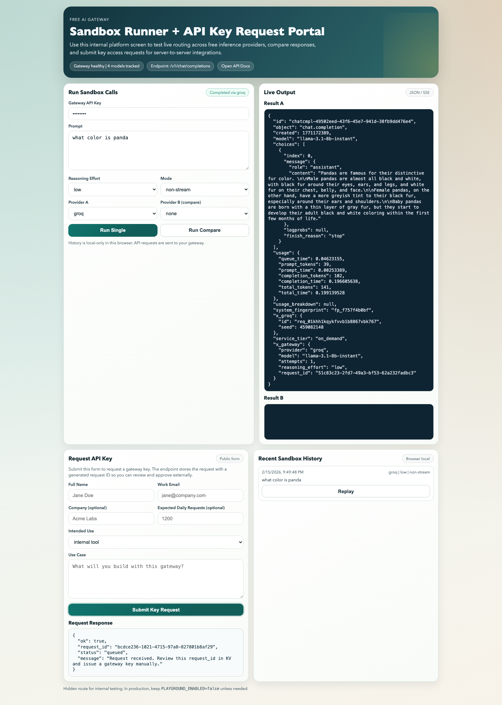

# Free AI Gateway (Cloudflare Worker)

OpenAI-compatible API gateway for text inference with health-aware routing across free providers.

## What You Get

- OpenAI-style `POST /v1/chat/completions`
- OpenAI-style `POST /v1/responses` (non-stream)
- Auto-routing by model health + `reasoning_effort`
- Provider adapters: Workers AI, Groq, Gemini, optional OpenRouter/Cerebras, optional `cli_bridge`
- Streaming and non-streaming responses
- Auth-protected API surface for server-to-server usage
- Hidden internal platform UI (`/playground`) for sandbox testing
- Public key-request intake endpoint (`POST /access/request-key`)

## Screenshots

Landing page:



Live sandbox result:



Key request submission:



## API Surface

- `GET /` (landing page; send `Accept: application/json` for machine-readable metadata)
- `POST /v1/chat/completions` (protected)
- `POST /v1/responses` (protected, non-stream)
- `GET /v1/models` (protected)
- `GET /health` (public)
- `GET /openapi.json` (protected)
- `GET /docs` (protected)
- `GET /playground` (public only when `PLAYGROUND_ENABLED=true`)
- `POST /access/request-key` (public)

Note: `/v1/responses` currently supports non-stream mode. Use `/v1/chat/completions` for streaming.

## Auth

Protected routes require:

```http
Authorization: Bearer <GATEWAY_API_KEY>
```

## Request/Response Extensions

`POST /v1/chat/completions` supports:

- `reasoning_effort`: `auto | low | medium | high`
- `prompt`: alias when `messages` is omitted
- `project_id`: optional project tag (`[a-zA-Z0-9._:-]`, max 64 chars)

Responses include:

- `x_gateway`: provider/model/attempt/request metadata
- `x_gateway.project_id`: echoed when provided

You can also send project metadata via header:

- `x-gateway-project-id: <project-id>`

## Quickstart

1. Install:

```bash
npm install
```

2. Configure env:

```bash
cp .env.example .env
# fill values
```

3. Start local worker:

```bash
npm run dev:local
```

4. Optional platform UI:

```bash
PLAYGROUND_ENABLED=true npm run dev:local
```

Open: `http://127.0.0.1:8787/playground`

## Examples

Reusable SDK example projects live in `/examples`:

- Node.js: `/examples/node-openai-sdk`
- Python: `/examples/python-openai-sdk`

See `/examples/README.md` for quick run commands.

## Environment Variables

Use `.env.example` as the template.

Core:

- `GATEWAY_API_KEY`
- `PLAYGROUND_ENABLED`
- `ENABLE_PHASE2`
- `AUTO_ISSUE_KEYS` (`true` returns an API key immediately from `/access/request-key`)

Phase 1 providers:

- `GROQ_API_KEY`
- `GEMINI_API_KEY`
- `CLOUDFLARE_ACCOUNT_ID` and `CLOUDFLARE_WORKERS_AI_API_KEY` (Workers AI REST fallback for local)
- `CLI_BRIDGE_URL` and optional `CLI_BRIDGE_PROVIDER`

Optional phase 2:

- `OPENROUTER_API_KEY`
- `CEREBRAS_API_KEY`

`npm run env:sync` copies allowed keys from `.env` into `.dev.vars` for Wrangler.

## cURL Examples

Set once:

```bash
export GATEWAY_URL="http://127.0.0.1:8787"
export GATEWAY_API_KEY="<your_gateway_key>"
```

OpenAI Node SDK:

```ts
import OpenAI from 'openai';

const client = new OpenAI({
  apiKey: process.env.GATEWAY_API_KEY,
  baseURL: 'https://free-ai-gateway.sarthakagrawal927.workers.dev/v1',
});

const response = await client.responses.create({
  model: 'auto',
  input: 'Write one line about edge AI',
});

console.log(response.output_text);
```

Non-stream chat (auto routing):

```bash
curl -sS "$GATEWAY_URL/v1/chat/completions" \
  -H "Authorization: Bearer $GATEWAY_API_KEY" \
  -H "Content-Type: application/json" \
  --data '{
    "model": "auto",
    "prompt": "Explain edge runtimes in 3 bullets",
    "reasoning_effort": "medium",
    "stream": false
  }'
```

Force Groq for debugging:

```bash
curl -sS "$GATEWAY_URL/v1/chat/completions" \
  -H "Authorization: Bearer $GATEWAY_API_KEY" \
  -H "Content-Type: application/json" \
  -H "x-gateway-force-provider: groq" \
  -H "x-gateway-project-id: project_analytics_api" \
  --data '{"prompt":"what color is panda","reasoning_effort":"low","stream":false}'
```

Responses API (OpenAI-compatible):

```bash
curl -sS "$GATEWAY_URL/v1/responses" \
  -H "Authorization: Bearer $GATEWAY_API_KEY" \
  -H "Content-Type: application/json" \
  --data '{
    "model": "auto",
    "input": "Write one sentence about routing",
    "stream": false
  }'
```

Streaming:

```bash
curl -N "$GATEWAY_URL/v1/chat/completions" \
  -H "Authorization: Bearer $GATEWAY_API_KEY" \
  -H "Content-Type: application/json" \
  --data '{"prompt":"Say hello in 5 languages","reasoning_effort":"low","stream":true}'
```

Models:

```bash
curl -sS "$GATEWAY_URL/v1/models" \
  -H "Authorization: Bearer $GATEWAY_API_KEY"
```

Health:

```bash
curl -sS "$GATEWAY_URL/health"
```

Key request API:

```bash
curl -X POST "$GATEWAY_URL/access/request-key" \
  -H "Content-Type: application/json" \
  --data '{
    "name": "Jane Doe",
    "email": "jane@acme.dev",
    "company": "Acme Labs",
    "use_case": "Internal support copilot for our ops team",
    "intended_use": "internal",
    "expected_daily_requests": 1200
  }'
```

## Key Issuance Workflow

- Default (`AUTO_ISSUE_KEYS=false`):
- User submits `/access/request-key` form or API call.
- Gateway stores request metadata in KV (`access-request:<request_id>`) and returns `status: "queued"`.
- Operator reviews request and manually issues a key.

- Auto-issue mode (`AUTO_ISSUE_KEYS=true`):
- `/access/request-key` returns `status: "approved"` with `api_key` immediately.
- Gateway stores only hashed key material in KV (`api-key:<sha256>`).
- Client uses issued key in `Authorization: Bearer <key>`.

## Scripts

- `npm run dev` -> Wrangler remote dev
- `npm run dev:local` -> local worker with `.env` sync
- `npm run deploy:cloudflare` -> one-command Cloudflare deploy bootstrap + deploy
- `npm run deploy` -> deploy worker
- `npm run check` -> typecheck + unit tests
- `npm run test:e2e` -> mocked FE tests
- `npm run test:e2e:live:update` -> live snapshot baseline
- `npm run test:e2e:live` -> live snapshot verify

## Testing

Unit + typecheck:

```bash
npm run check
```

Mocked FE tests:

```bash
npm run test:e2e
```

Live Playwright snapshot tests (real providers, requires keys):

```bash
npm run test:e2e:live:update
npm run test:e2e:live
```

Python OpenAI SDK smoke test (deployed URL):

```bash
python3 -m venv .venv
source .venv/bin/activate
python -m pip install openai
python scripts/test_deployed_openai_sdk.py \
  --gateway-base-url https://free-ai-gateway.sarthakagrawal927.workers.dev
```

## Deploy

Recommended (one command):

```bash
npm run deploy:cloudflare
```

What this does:

- verifies Cloudflare auth (`wrangler whoami`)
- auto-resolves/creates `HEALTH_KV` + preview namespace
- generates local `.wrangler.deploy.toml` with resolved KV IDs
- uploads secrets from `.env` in bulk
- deploys and prints the `workers.dev` URL

Useful flags:

```bash
node scripts/deploy-cloudflare.mjs --prepare-only
node scripts/deploy-cloudflare.mjs --skip-secrets
```

Manual path:

1. Set secrets:

```bash
npx wrangler secret put GATEWAY_API_KEY
npx wrangler secret put GROQ_API_KEY
npx wrangler secret put GEMINI_API_KEY
npx wrangler secret put CLOUDFLARE_ACCOUNT_ID
npx wrangler secret put CLOUDFLARE_WORKERS_AI_API_KEY
# optional
npx wrangler secret put OPENROUTER_API_KEY
npx wrangler secret put CEREBRAS_API_KEY
```

2. Deploy:

```bash
npm run deploy
```

## Notes

- Keep `PLAYGROUND_ENABLED=false` in production unless explicitly needed.
- Logs are metadata-oriented; raw prompt/completion storage is avoided by design.
- If you pasted any real provider keys into chat, rotate them.
